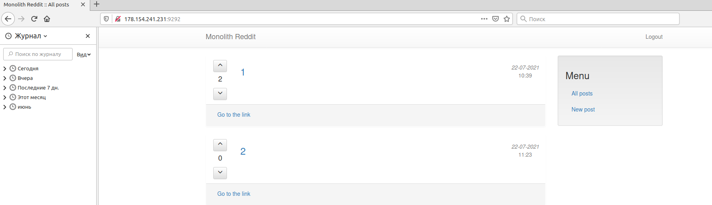
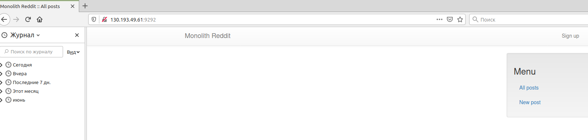

# panthrashkov_infra
panthrashkov Infra repository

# Работа с ansible
1. Install ansible (use mint programm manadger)
2. Check version
ansible --version
   output
   ansible 2.9.6
3. Run 2 VM from terraform 2 homework
   external_ip_address_app = 130.193.49.61
   external_ip_address_db = 130.193.38.232
  
4. Create inventory file with host app
   appserver ansible_host=130.193.49.61 ansible_user=ubuntu ansible_private_key_file=~/.ssh/appuser
5. Check ansible can connect to our host
   ansible appserver -i ./inventory -m ping
output
   appserver | SUCCESS => {
   "ansible_facts": {
   "discovered_interpreter_python": "/usr/bin/python3"
   },
   "changed": false,
   "ping": "pong"
   }
6. Create inventory file with host db
   dbserver ansible_host=130.193.38.232 ansible_user=ubuntu ansible_private_key_file=~/.ssh/appuser
7. Check ansible can connect to our host (use module ping)
   ansible dbserver -i ./inventory -m ping
   output
   dbserver | SUCCESS => {
   "ansible_facts": {
   "discovered_interpreter_python": "/usr/bin/python3"
   },
   "changed": false,
   "ping": "pong"
   }
8. Create  ansible.cfg to store common settings and remove that data from invetory file
   appserver ansible_host=130.193.49.61
   dbserver ansible_host=130.193.38.232 
   
9. User ansible module command, to check connectivity
   ansible dbserver -m command -a uptime
   ansible appserver -m command -a uptime
   output
   dbserver | CHANGED | rc=0 >>
   12:56:39 up 33 min,  1 user,  load average: 0.00, 0.00, 0.00
10. Create group of host in inventory file
11. User groups to make some change on hosts
    ansible app -m ping
    
12. Use yaml format to inventory
13. Check yaml inventory to conneectivity
    ansible all -m ping -i inventory.yml
    
14. Check is ruby installed on app server
    ansible app -m command -a 'ruby -v'
    output
    appserver | CHANGED | rc=0 >>
    ruby 2.3.1p112 (2016-04-26) [x86_64-linux-gnu]
15. Check is bundler installed on app server
    ansible app -m command -a 'bundler -v'
    output
    appserver | CHANGED | rc=0 >>
    Bundler version 1.11.2
16. wrong use module command with two arguments
    ansible app -m command -a 'ruby -v; bundler -v'
    error output
    appserver | FAILED | rc=1 >>
    ruby: invalid option -;  (-h will show valid options) (RuntimeError)non-zero return code
17. Use shell module with two commands
    ansible app -m shell -a 'ruby -v; bundler -v'
   output
    appserver | CHANGED | rc=0 >>
    ruby 2.3.1p112 (2016-04-26) [x86_64-linux-gnu]
    Bundler version 1.11.2
18. Check mongo on db server
    ansible db -m command -a 'systemctl status mongod'
    output
    dbserver | CHANGED | rc=0 >>
    ● mongod.service - High-performance, schema-free document-oriented database
    Loaded: loaded (/lib/systemd/system/mongod.service; enabled; vendor preset: enabled)
    Active: active (running) since Tue 2021-07-20 12:23:47 UTC; 1h 35min ago
    Docs: https://docs.mongodb.org/manual
    Main PID: 639 (mongod)
    CGroup: /system.slice/mongod.service
    └─639 /usr/bin/mongod --quiet --config /etc/mongod.conf

Jul 20 12:23:47 fhm3itgsbarggluugg4l systemd[1]: Started High-performance, schema-free document-oriented database.
19. Use same check with module systemd
    ansible db -m systemd -a name=mongod
    output
    dbserver | SUCCESS => {
    "ansible_facts": {
    "discovered_interpreter_python": "/usr/bin/python3"
    },
    "changed": false,
    "name": "mongod", ...
    
20. Use same check with module service
    ansible db -m service -a name=mongod
    output
    dbserver | SUCCESS => {
    "ansible_facts": {
    "discovered_interpreter_python": "/usr/bin/python3"
    },
    "changed": false,
    "name": "mongod",
      ...
21. Use git module to clone repository on app servers
    ansible app -m git -a \'repo=https://github.com/express42/reddit.git dest=/home/appuser/reddit'
    with error
    appserver | FAILED! => {
    "ansible_facts": {
    "discovered_interpreter_python": "/usr/bin/python3"
    },
    "changed": false,
    "msg": "Failed to find required executable git in paths: /usr/local/sbin:/usr/local/bin:/usr/sbin:/usr/bin:/sbin:/bin:/usr/games:/usr/local/games:/snap/bin"

need install git
to install write simple playbook 
- name: Install git
  hosts: app
  become: true
  tasks:
    - name: Install git
      apt:
      name: git
      state: present
      update_cache: yes
      
run play book ansible-playbook apt_install_git.yml
output
appserver                  : ok=2    changed=1    unreachable=0    failed=0    skipped=0    rescued=0    ignored=0

try clone once again
ansible app -m git -a 'repo=https://github.com/express42/reddit.git dest=/home/appuser/reddit' -b
output
appserver | CHANGED => {
"after": "5c217c565c1122c5343dc0514c116ae816c17ca2",
"ansible_facts": {
"discovered_interpreter_python": "/usr/bin/python3"
},
"before": null,
"changed": true
}

22. Use same command twice with no effect because ansible check is repo existed
output
    appserver | SUCCESS => {
    "after": "5c217c565c1122c5343dc0514c116ae816c17ca2",
    "ansible_factsy": {
    "discovered_interpreter_python": "/usr/bin/python3"
    },
    "before": "5c217c565c1122c5343dc0514c116ae816c17ca2",
    "changed": false,
    "remote_url_changed": false
    }
changed false
    
23. Use same thing with command
    ansible app -m command -a 'git clone https://github.com/express42/reddit.git /home/appuser/reddit'
output appserver | FAILED | rc=128 >>
    fatal: destination path '/home/appuser/reddit' already exists and is not an empty directory.non-zero return code

24. Try same thing use playbook clone.yml (added become to playbook)
output
    appserver                  : ok=2    changed=0    unreachable=0    failed=0    skipped=0    rescued=0    ignored=0   
25. Remove reddit repository from app servers
    ansible app -m command -a 'rm -rf ~/reddit'
    
26. run clone again
    TASK [Clone repo] *************************************************************************************************************************************************************************************************************************
    changed: [appserver]

PLAY RECAP ********************************************************************************************************************************************************************************************************************************
appserver                  : ok=2    changed=1    unreachable=0    failed=0    skipped=0    rescued=0    ignored=0 

exist changed task because we remove repository by hand, and clone work again

**End first homework**

### **Start second homework**

27. Create playbook to deploy our application reddit_app.yml playbook contains one task to copy 
    mongod config file from template 
    use module template
    use j2 template file (templates/mongodconf.j2)
    before run create our vm with terraform apply (stage environment) and change ips
    run playbook with --check option and only on hosts in db group
    ```ansible
    ansible-playbook reddit_app.yml --check --limit db
    ```
28. Error
    TASK [Change mongo db config file] ***********************************************************************************************************************************************************************************************************
    fatal: [dbserver]: FAILED! => {"changed": false, "msg": "AnsibleUndefinedVariable: 'mongo_bind_ip' is undefined"}
    
29. Add variable mongo_bind_ip into playbook block vars
    ok output -
    PLAY RECAP ***********************************************************************************************************************************************************************************************************************************
    dbserver                   : ok=2    changed=1    unreachable=0    failed=0    skipped=0    rescued=0    ignored=0 

30. Use handler to restart mongod after success reconfig to reddit_app.yml playbook
    run playbook with --check option and only on hosts in db group
    ```ansible
    ansible-playbook reddit_app.yml --check --limit db
    ```
    
31. Run without check to apply our config 
output ok
    PLAY RECAP ***********************************************************************************************************************************************************************************************************************************
    dbserver                   : ok=3    changed=2    unreachable=0    failed=0    skipped=0    rescued=0    ignored=0  
32. Add new two task to config app server and one handler
first task use module copy to copy startup script
second task use module systemd to run startup script
handler use use module systemd to restart service puma
33. Use db_config file to pass database url to application server
add new task to copy db_config file to application server
34. Add variable db_host in vars block
35. Run playbook with check option on app servers group and only for tasks with app-tag
    ansible-playbook reddit_app.yml --check --limit app --tags app-tag
    output ok
    PLAY RECAP ***********************************************************************************************************************************************************************************************************************************
    appserver                  : ok=5    changed=4    unreachable=0    failed=0    skipped=0    rescued=0    ignored=0 
36. run without --check option (use user ubuntu on application server)

37. Add new task to install git clone repo and setup bundler
38. try connect to reddit - ok


39. One playbook many plays - change to separate playbooks in one file reddit_app2
First playbook for config db host
Second playbook for config app host
Third playbook for deploy app to app host
Use tags on playbook level
    
40. Remove vm and create it clean again
    terraform destroy
    terraform apply -auto-approve=false
41. Change ip settings
42. run playbook tree times with different tags
    ansible-playbook reddit_app2.yml --tags db-tag
    ansible-playbook reddit_app2.yml --tags app-tag
    ansible-playbook reddit_app2.yml --tags deploy-tag
    
43. Application works http://130.193.49.61:9292/

44. Split playbooks to different files
app.yml
db.yml
deploy.yml

and copy suitable plays from reddit_app_multiple_plays.yml. Remove tags because they don't needed anymore.
45. Create main playbook (site.yml) and import other playbook there
46. Recreate vm with terraform and change ip
47. Run main playbook
    ansible-playbook site.yml --check
    ansible-playbook site.yml
48. Application works

   
49.  Use ansible provisioners for packer
create provisiones packer_app.yml packer_db.yml
     
50. Replace provisioners in packer/app.json and packer/db.json
51. Create new images
    packer build  -var-file=packer/variables.json ./packer/db.json