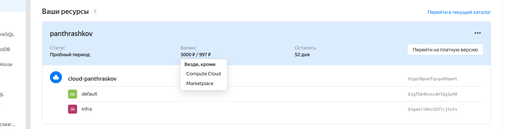
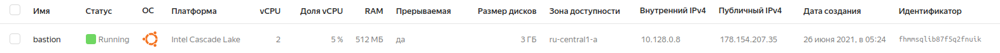

# panthrashkov_infra
panthrashkov Infra repository

# Знакомство с облачной инфраструктурой и облачными сервисами

# Цели занятия
проанализировать основные практики безопасного доступа к ресурсам (SSH, Bastion Host, VPN)
# Выполнение задания
1. Создать аккаунт на yandex cloud
https://console.cloud.yandex.ru/

   
2. Генерация пары ключей
   ssh-keygen -t rsa -f ~/.ssh/appuser -C appuser -P ""
   
3. Создали vm bastion

   Публичный ip = 178.154.207.35 (BASTION_IP=178.154.207.35)
   
4. Подключение по публичному ip
   ssh -i ~/.ssh/appuser appuser@178.154.207.35
 ок - Welcome to Ubuntu 20.04.2 LTS (GNU/Linux 5.4.0-42-generic x86_64) ...
   cat /etc/issue
 ok -  Ubuntu 20.04.2 LTS \n \l

5. VPC - https://console.cloud.yandex.ru/folders/b1gaeis0eu1b5lcjtuts/vpc/addresses

   
6.Создали vm someinternalhost
 внутренний ip = 10.128.0.18 (SOMEINTERNALHOST_IP=10.128.0.18)

7. Подключаемся с bastion
   appuser@bastion:~$ ssh 10.128.0.18
   error - appuser@10.128.0.18: Permission denied (publickey).
   
8. Настроим SSH Forwarding на вашей локальной машине
   ssh-add -L
   Добавим приватный ключ в ssh агент авторизации
   ssh-add ~/.ssh/appuser
ok - Identity added: /home/alex/.ssh/appuser (appuser)
   
9. Пробуем  подключаться  вновь,  добавив  в  параметры  подключенияключик -A, чтобы явно включить SSH Agent Forwarding
   ssh -i ~/.ssh/appuser -A appuser@$BASTION_IP
   appuser@bastion:~$ ssh $SOMEINTERNALHOST_IP
   appuser@someinternalhost:~$ hostname
ok - someinternalhost
   ip a show eth0
ok -   2: eth0: <BROADCAST,MULTICAST,UP,LOWER_UP> mtu 1500 qdisc mq state UP group default qlen 1000
   link/ether d0:0d:66:f6:50:2c brd ff:ff:ff:ff:ff:ff
   inet 10.128.0.18/24 brd 10.128.0.255 scope global eth0
   valid_lft forever preferred_lft forever
   inet6 fe80::d20d:66ff:fef6:502c/64 scope link
   valid_lft forever preferred_lft forever

10. Проверим отсутствие каких-либо приватных ключей на bastion машине
    ls -la ~/.ssh/
ok -  total 16
    drwx------ 2 appuser appuser 4096 Jun 26 02:42 .
    drwxr-xr-x 4 appuser appuser 4096 Jun 26 02:48 ..
    -rw------- 1 appuser appuser  561 Jun 26 02:25 authorized_keys
    -rw-r--r-- 1 appuser appuser  222 Jun 26 02:42 known_hosts
    
11. Исследовать  способ  подключения  к someinternalhost  в  однукоманду  из  вашего  рабочего  устройства, 
    проверить  работоспособностьнайденного решения и внести его в README.md в вашем репозитории

ssh -J appuser@$BASTION_IP appuser@$SOMEINTERNALHOST_IP

12. Настраиваем VPN
    cat <<EOF> setupvpn.sh

#!/bin/bash
> echo "deb [ arch=amd64,arm64 ] https://repo.mongodb.org/apt/ubuntu focal/mongodb-org/4.4 multiverse" > /etc/apt/sources.list.d/mongodb-org-4.4.list
> echo "deb http://repo.pritunl.com/stable/apt focal main" > /etc/apt/sources.list.d/pritunl.list
> curl -fsSL https://www.mongodb.org/static/pgp/server-4.4.asc | apt-key add -
> apt-key adv --keyserver hkp://keyserver.ubuntu.com --recv 9DA31620334BD75D9DCB49F368818C72E52529D4
> apt-key adv --keyserver hkp://keyserver.ubuntu.com --recv 7568D9BB55FF9E5287D586017AE645C0CF8E292A
> apt-get --assume-yes update
> apt-get --assume-yes upgrade
> apt-get --assume-yes install pritunl mongodb-org
> systemctl start pritunl mongod
> systemctl enable pritunl mongod
> EOF

sudo bash setupvpn.sh

