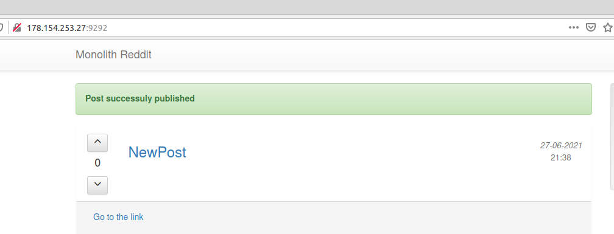

# panthrashkov_infra
panthrashkov Infra repository

# Знакомство с облачной инфраструктурой и облачными сервисами

# IP
bastion_IP=178.154.200.159
someinternalhost_IP=10.128.0.18
# Исследовать  способ  подключения  к someinternalhost  в  однукоманду  из  вашего  рабочего  устройства,
# проверить  работоспособностьнайденного решения и внести его в README.md в вашем репозитории
ssh -J appuser@$bastion_IP appuser@$someinternalhost_IP


# Деплой тестового приложения

# Установка yandex command line interface
```bash
curl https://storage.yandexcloud.net/yandexcloud-yc/install.sh | bash
```
Настройка 
```bash
yc config profile create test
yc config set folder-id b1gekr0t12ng66bs3chh
yc config set token AQAAAAAfwduPAATuwbKsnQ_4qE4mv2J0kBiDe6o
yc  config profile get test
yc config profile list
```

Создание  машины

```bash
yc compute instance create \
  --name reddit-app \
  --hostname reddit-app \
  --create-boot-disk image-folder-id=standard-images,image-family=ubuntu-1604-lts,size=10GB \
  --network-interface subnet-name=default-ru-central1-a,nat-ip-version=ipv4 \
  --metadata serial-port-enable=1 \
  --ssh-key ~/.ssh/appuser.pub
```
Копируем IP
testapp_IP=178.154.253.27
testapp_port=9292

Подключаемся к удаленной машине
```bash
ssh yc-user@$testapp_IP
```

Обновляем APT и устанавливаем Ruby и Bundler:
```bash
sudo apt update
sudo apt install -y ruby-full ruby-bundler build-essential
```

Проверяем
```bash
ruby -v
```
ок - ruby 2.3.1p112 (2016-04-26) [x86_64-linux-gnu]
```bash
bundler -v
```
ок - Bundler version 1.11.2

Устанавливаем Mongo
```bash
wget -qO - https://www.mongodb.org/static/pgp/server-4.2.asc | sudo apt-key add -
echo "deb [ arch=amd64,arm64 ] https://repo.mongodb.org/apt/ubuntu xenial/mongodb-org/4.2 multiverse" | sudo tee /etc/apt/sources.list.d/mongodb-org-4.2.list
sudo apt-get update
sudo apt-get install -y mongodb-org
```
Запускаем MongoDB:
```bash
sudo systemctl start mongod
```
Добавляем в автозапуск
```bash
sudo systemctl enable mongod
```
Проверяем работу MongoDB
```bash
sudo systemctl status mongod
```
Ставим git
```bash
sudo apt install git
```
Clone project
```bash
git clone -b monolith https://github.com/express42/reddit.git
```
Set project dependencies
```bash
cd reddit && bundle install
```
Run application server
```bash
puma -d
```
Check is application running and get port
```bash
ps aux | grep puma
```
output  -yc-user   3611  0.5  1.3 516716 26704 ?        Sl   21:28   0:00 puma 3.10.0 (tcp://0.0.0.0:9292) [reddit]
log in application and make post


Make scripts
make files executables
```bash
git update-index --chmod=+x path/to/file
```
